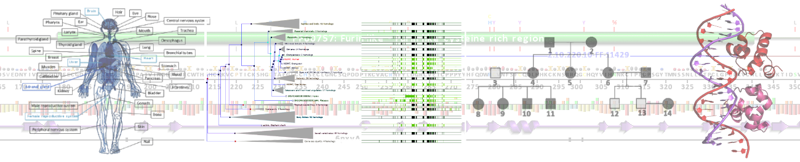

# MEDC0106: Python Workshop

This repository contains material for the Bioinformatics in Applied Biomedical Science ([MEDC0106](https://www.ucl.ac.uk/module-catalogue/modules/bioinformatics-in-applied-biomedical-science-MEDC0106)) Python workshop.

  
   

## Getting Started

To get started with the workshop please click here:
.
The process may take ~10 minutes to get started, although there is nothing you will need to install on your local
computer.

## Workshop Format

This workshop takes place over three sessions, consisting of a set of introductory notebooks and exercises to complete.
You should complete the introductory notebooks in the current session before attempting the excersises, unless you are
already comfortable with the material. The exercises contain a mix of easy to challenging tasks. Do not worry if you 
struggle to complete some exercises, we will go over them at the begining of the next session.

- Session 1
    1. Introduction to Python
    2. Introduction to Functions
    3. Modules and Packages 
    4. Exercises

- Session 2
    1. Introduction to NumPy
    2. Introduction to Pandas
    3. Introduction to Predictive Modelling
    4. Exercises

- Session 3

## Contact

Please contact us if you have questions or suggestions:

- Students please use the [UCL Moodle](https://moodle.ucl.ac.uk/course/view.php?id=20875) discussion forum.
- Questions regarding bugs or incorrect information please [open an issue](https://github.com/MEDC0106/PythonWorkshop/issues) or [pull request](https://github.com/MEDC0106/PythonWorkshop/pulls)

## License

This work is licensed under the Attribution 4.0 International (CC BY 4.0).
To view a copy of this license, visit http://creativecommons.org/licenses/by/4.0/

## Acknowledgments

### External resources

#### Python packages

- Bioinformatics:
    - [`biopython`](https://biopython.org/)
    
- Data Science:
    - [`numpy`](https://numpy.org/), [`pandas`](https://pandas.pydata.org/), [`scikit-learn`](https://scikit-learn.org/stable/), [`scipy`](https://scipy.org/)

- Data Visualisation:
    - [`matplotlib`](https://matplotlib.org/), [`seaborn`](https://seaborn.pydata.org/)

If we are using your resource and forgot to add it here, please contact us so that we can rectify this, thank you!

### Authors

- [Oliver Scott](https://github.com/OliverBScott) 
- [Mateusz Kaczyński](https://github.com/ellimilial)
